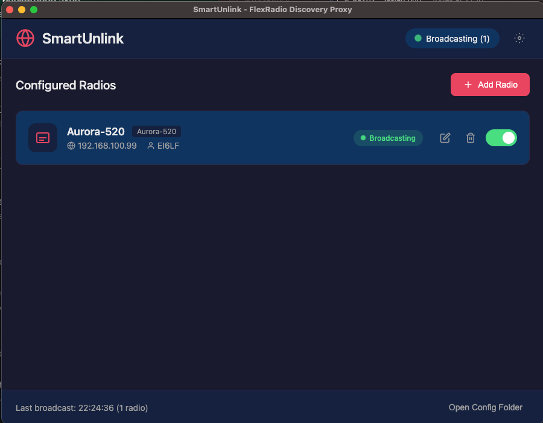
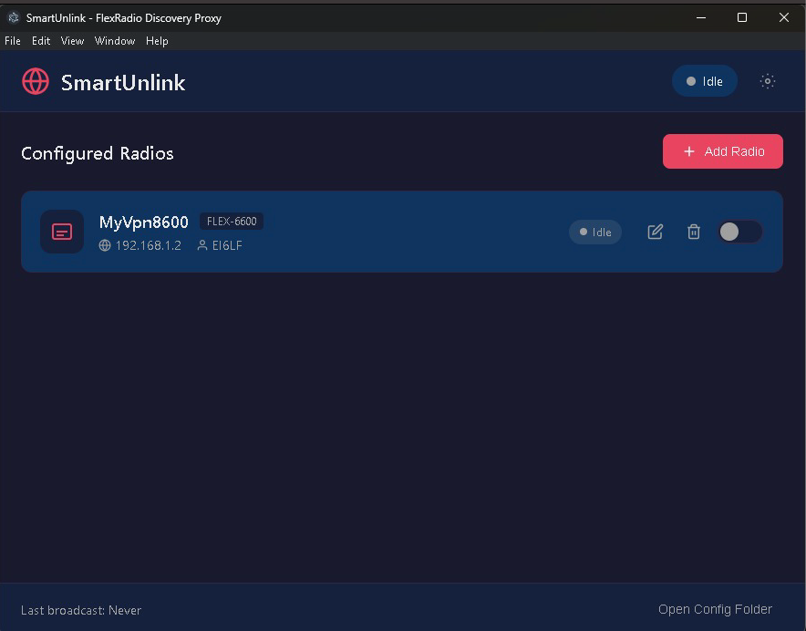
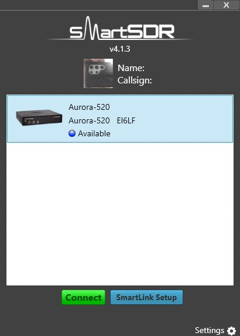

# SmartUnlink

**Make your FlexRadio visible over VPN connections**

## The Problem

If you've ever tried to use your FlexRadio remotely over a VPN, you've probably run into a frustrating issue: **SmartSDR can't find your radio**.

This happens because FlexRadio uses a discovery system that broadcasts special packets on your local network to announce "Hey, I'm here!". These broadcast packets work great on your home network, but VPNs typically don't forward them. So when you're connected via VPN from a remote location, SmartSDR sits there searching... and searching... and never finds your radio.

## The Solution

SmartUnlink solves this problem by running on a computer at your remote location (where SmartSDR is running) and broadcasting those discovery packets on your behalf. It tells SmartSDR "there's a FlexRadio at this IP address" - and suddenly your radio appears!

## How It Works

1. Install SmartUnlink on your remote computer (the one running SmartSDR)
2. Add your radio's details (name, IP address, model, callsign)
3. Enable broadcasting
4. Open SmartSDR - your radio will appear!

That's it. No complicated network configuration required.

## Screenshots

### SmartUnlink on macOS


### SmartUnlink on Windows


### SmartSDR Finding Your Radio


## Download

### Windows
Download the latest Windows installer or portable executable from the [Releases](https://github.com/brianbruff/SmartUnlink/releases) page.

Look for files like:
- `SmartUnlink-Setup-1.0.2.exe` - Windows installer
- `SmartUnlink-1.0.2-portable.exe` - Portable version (no install needed)

### macOS / Linux
SmartUnlink is built with Electron, making it cross-platform. Clone the repository and run:

```bash
npm install
npm start
```

## Supported Radios

- Aurora-510
- Aurora-520
- FLEX-6400 / 6400M
- FLEX-6600 / 6600M
- FLEX-6700
- FLEX-8400
- FLEX-8600

## License

MIT License - feel free to use, modify, and share.

---

*SmartUnlink is not affiliated with FlexRadio Systems.*
